## 常见APP类型及技术架构

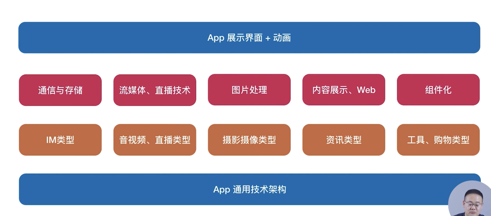

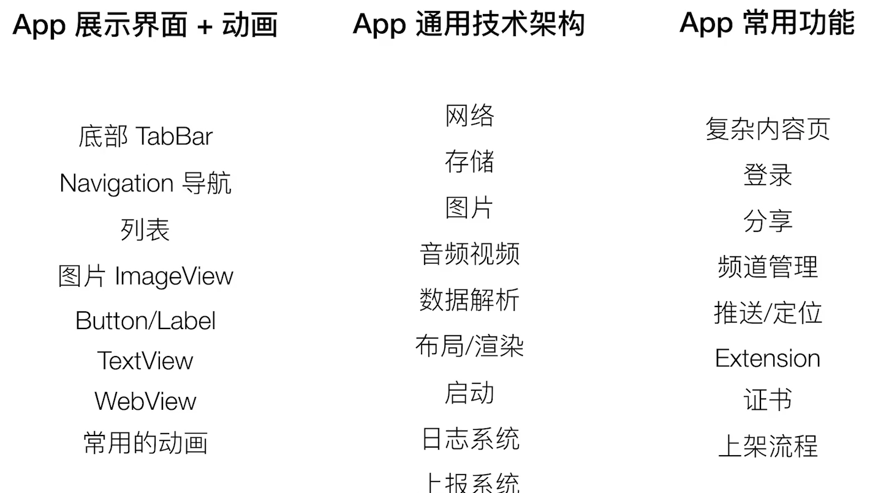

## 创建第一个Xcode工程

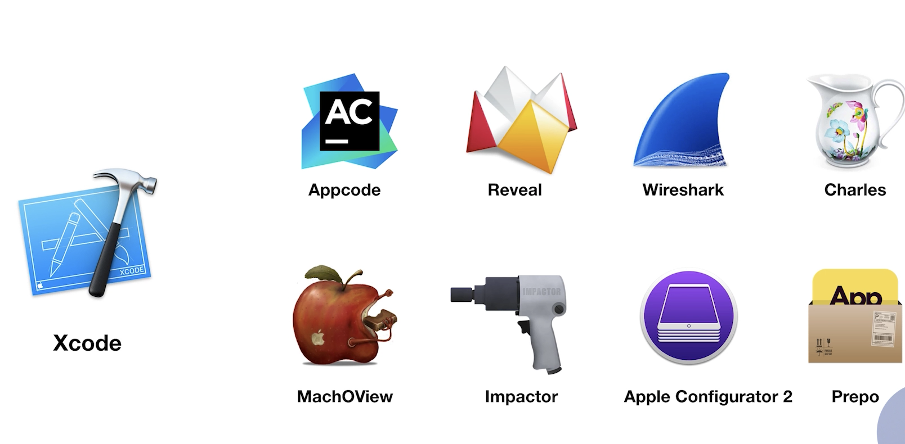


```js
#import "ViewController.h"

@interface ViewController ()

@end

@implementation ViewController

- (void)viewDidLoad {
    [super viewDidLoad];
    // Do any additional setup after loading the view.
    [self.view addSubview:({
        UILabel * label = [[UILabel alloc] init];
        label.text = @"hello world11";
        [label sizeToFit];
        label.center = CGPointMake(self.view.frame.size.width/2
                                   , self.view.frame.size.height/2);
        label;
        
    })];
}


@end
```

## ios中的mvc

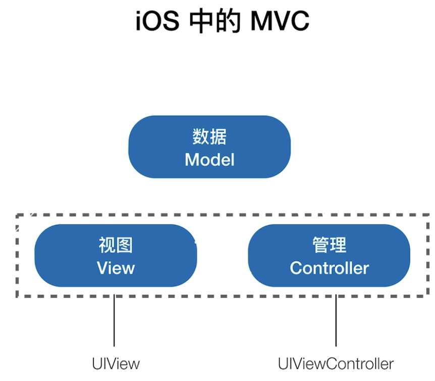

## 创建一个 UIView

UIView：

+ 最基础的视图类，管理屏幕上一定区域的内容展示
+ 作为各种视图类型的父类，提供基础的能力
+ 可以添加子视图（嵌套）

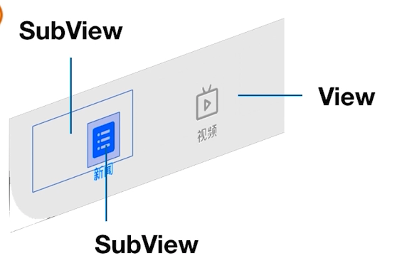

### 布局

1. 设置大小、位置(frame)
2. addSubView

使用栈管理全部的子View

+ 位置重叠的展示最后入栈的（view2和view3有重叠，先展示view3）
+ 可以随时调整位置
+ 插入到指定位置

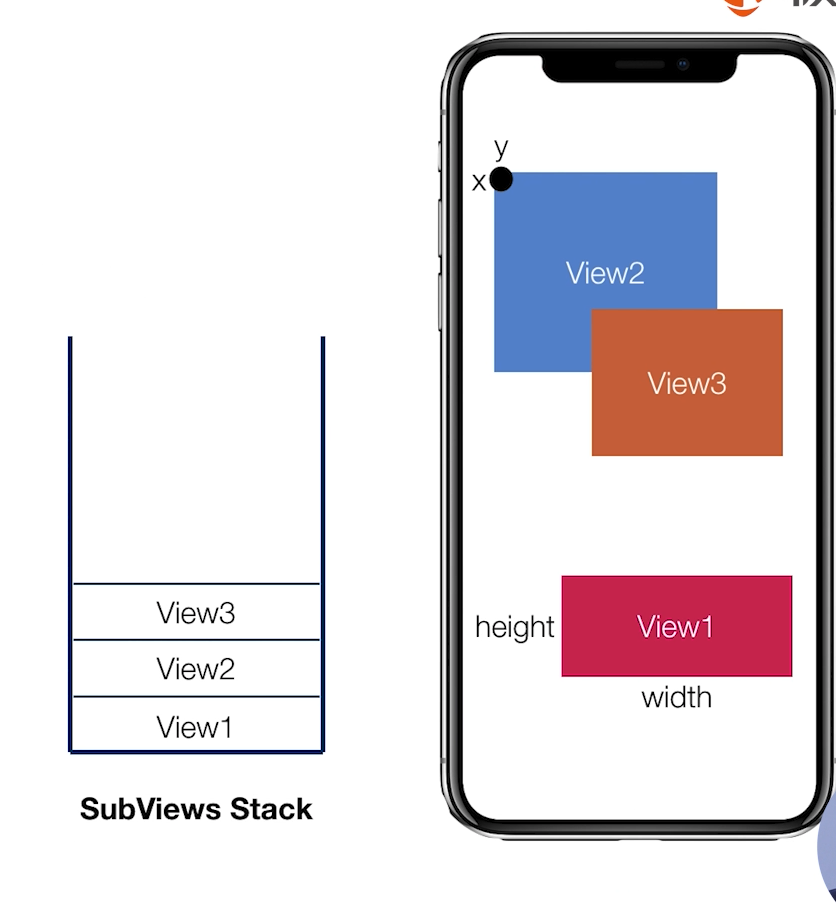

添加一个距离屏幕左上角(100,100)，宽高为100的红色区块

```js
//
//  ViewController.m
//  SampleAPP
//
//

#import "ViewController.h"

@interface ViewController ()

@end

@implementation ViewController

- (void)viewDidLoad {
    [super viewDidLoad];
    UIView *view = [[UIView alloc] init];
    view.backgroundColor = [UIColor redColor];
    view.frame = CGRectMake(100, 100,100,100);
    [self.view addSubview:view];
}

@end
```

## UIView声生命周期

+ willMoveToSuperview
+ didMoveToSuperView
+ willMoveToWindow
+ didMoveToWindow

```js

@interface TestView : UIView

@end

@implementation TestView

- (instancetype)init{
    self = [super init];
    if(self){
        
    }
    return self;
}

- (void)willMoveToSuperview:(nullable UIView *)newSuperview{
    [super willMoveToSuperview:newSuperview];
}

- (void)didMoveToSuperview{
    [super didMoveToSuperview];
}

- (void)willMoveToWindow:(UIWindow *)newWindo{
    [super willMoveToWindow:newWindo];
}

- (void)didMoveToWindow{
    [super didMoveToWindow];
}

@end
```

## 通过UIViewController来管理视图

视图控制器，管理视图View层级结构。自身包含View(default view)，可以理解为一个容器

+ 管理View视图的生命周期
+ 响应用户操作(滚动)
+ 和App整体交互，视图的切换
+ 作为一个container管理多个Contriller和动画

### ViewController的生命周期

+ init
+ viewDidLoad
+ viewWillAppear
+ viewDidAppear
+ viewWillDisappear
+ viewDidDisappear
+ Dealloc

选择合适的函数处理不同的业务

所有和view相关的初始化工作都应该放到viewDidLoad中

## 实现你的第一个TabBar页面

使用UIView和UIViewController的特性搭建App

+ UIView负责页面内的内容展现
+ 使用基础的UIViewController管理多个UIView
+ UIViewController在管理UIView的同时，负责不同页面的切换

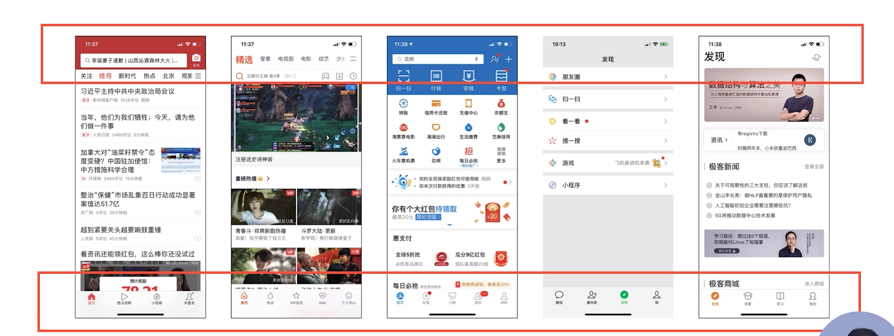

### 单页面展示

+ 通过列表展示简介
+ 通过较长滚动页面展示内容

单个页面就是一个UIViewController，其中包含多个UIView视图

### 多页面管理

+ 4个或5个底部按钮
+ 通过Push的方式进行页面切换

多页面切换，需要两个或多个UIViewController来控制页面的切换

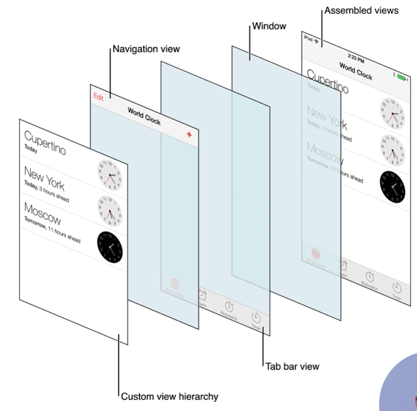

### UITabBarController

UITabBarController功能就是管理多个ViewController切换，通过点击底部对应按钮，选中对应需要展示的ViewController,国内App一般展示4-5个选项

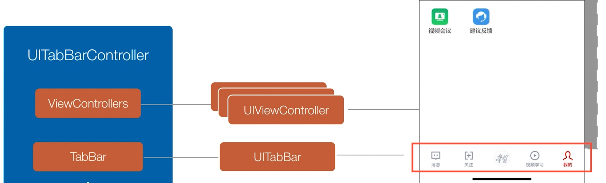

### UITabBar

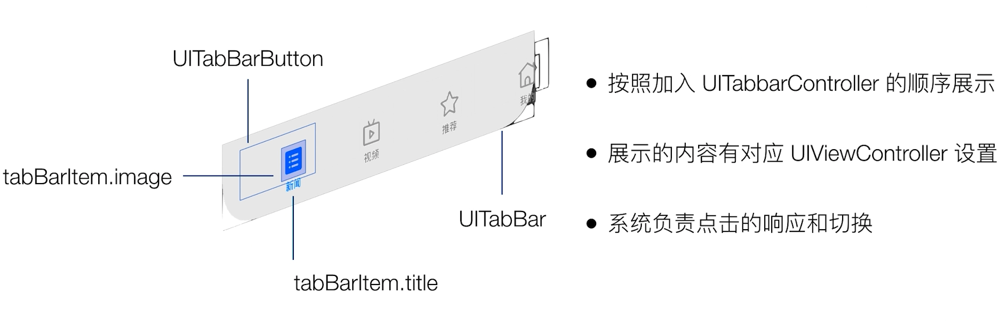

### 实现自己的TabBar

+ 使用系统函数实现
+ 相关开源框架和项目

    开源Tabbar/TabBarController主要是做了简易的封装+5个按钮的样式

    1.完全自己实现

    2.TabBar上粘贴自定义的SubView，响应事件调用系统方法

**注意**：

iOS13中appdelegate的职责发现了改变：
iOS13之前，Appdelegate的职责全权处理App生命周期和UI生命周期；
iOS13之后，Appdelegate的职责是：
1、处理 App 生命周期
2、新的 Scene Session 生命周期
那UI的生命周期交给新增的Scene Delegate处理

在SceneDelegate.m文件中，添加如下代码，为屏幕下边添加TabBar

```objc
    UIWindowScene *windowScene = (UIWindowScene *)scene;
    self.window = [[UIWindow alloc] initWithWindowScene:windowScene];
    self.window.frame = windowScene.coordinateSpace.bounds;
    
    UITabBarController *tabbarController = [[UITabBarController alloc] init];
    
    UIViewController *controller1 = [[UIViewController alloc] init];
    controller1.view.backgroundColor = [UIColor redColor];
    controller1.tabBarItem.title = @"新闻";
    
    UIViewController *controller2 = [[UIViewController alloc] init];
    controller2.view.backgroundColor = [UIColor yellowColor];
    controller2.tabBarItem.title = @"视频";
    
    UIViewController *controller3 = [[UIViewController alloc] init];
    controller3.view.backgroundColor = [UIColor blueColor];
    controller3.tabBarItem.title = @"推荐";
    
    UIViewController *controller4 = [[UIViewController alloc] init];
    controller4.view.backgroundColor = [UIColor greenColor];
    controller4.tabBarItem.title = @"我的";
    
    // 将四个页面的 UIViewController 加入到 UITabBarController 之中
    [tabbarController setViewControllers: @[controller1, controller2, controller3, controller4]];
    
    self.window.rootViewController = tabbarController;
    [self.window makeKeyAndVisible];

```

## 使用UINavigationController管理页面切换

UINavigationController

+ 通过栈管理页面间的跳转
+ 通常只展示栈顶页面
+ Push/Pop操作

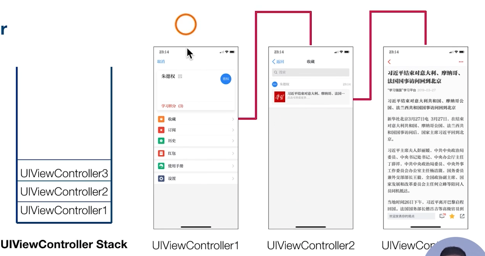

使用UINavigationController管理页面

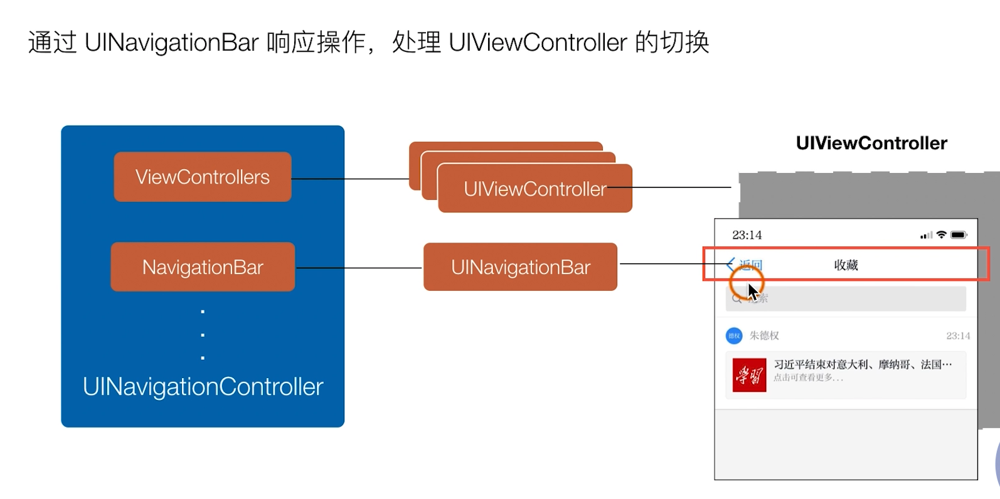

### UINavigationBar

+ 由UINavigationController管理
+ 顶部UINavigationController变化，UINavigationBar则同步变化

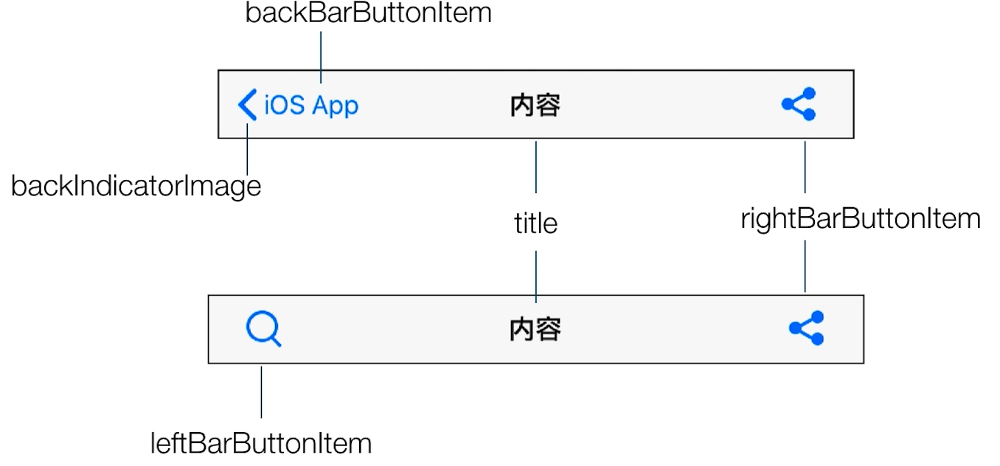

### 实现自己的Navigation

SceneDelegate.m文件,注意UINavigationController的创建

```objc
    UIWindowScene *windowScene = (UIWindowScene *)scene;
    self.window = [[UIWindow alloc] initWithWindowScene:windowScene];
    self.window.frame = windowScene.coordinateSpace.bounds;
    
    UITabBarController *tabbarController = [[UITabBarController alloc] init];
    
    ViewController *viewController = [[ViewController alloc] init];
    
    //UINavigationController创建
    UINavigationController *navigationController = [[UINavigationController alloc] initWithRootViewController:viewController];
    
//UIViewController *controller1 = [[UIViewController alloc] init];
 //   controller1.view.backgroundColor = [UIColor redColor];
    navigationController.tabBarItem.title = @"新闻";
    
    UIViewController *controller2 = [[UIViewController alloc] init];
    controller2.view.backgroundColor = [UIColor yellowColor];
    controller2.tabBarItem.title = @"视频";
    
    UIViewController *controller3 = [[UIViewController alloc] init];
    controller3.view.backgroundColor = [UIColor blueColor];
    controller3.tabBarItem.title = @"推荐";
    
    UIViewController *controller4 = [[UIViewController alloc] init];
    controller4.view.backgroundColor = [UIColor greenColor];
    controller4.tabBarItem.title = @"我的";
    
    // 将四个页面的 UIViewController 加入到 UITabBarController 之中
    [tabbarController setViewControllers: @[navigationController, controller2, controller3, controller4]];
    
    self.window.rootViewController = tabbarController;
    [self.window makeKeyAndVisible];
```

在ViewController.m中，在viewDid钩子函数添加

```objc
 UITapGestureRecognizer *tapGesture = [[UITapGestureRecognizer alloc] initWithTarget:self action:@selector(pushController)];
    [view addGestureRecognizer:tapGesture];
```

对应的pushController

```objc
- (void)pushController{
    
    UIViewController *viewController = [[UIViewController alloc] init];
    viewController.view.backgroundColor = [UIColor whiteColor];
    viewController.navigationItem.title = @"内容";
    [self.navigationController pushViewController:viewController animated:(YES)];
    
    
}
```

## APP中的窗口

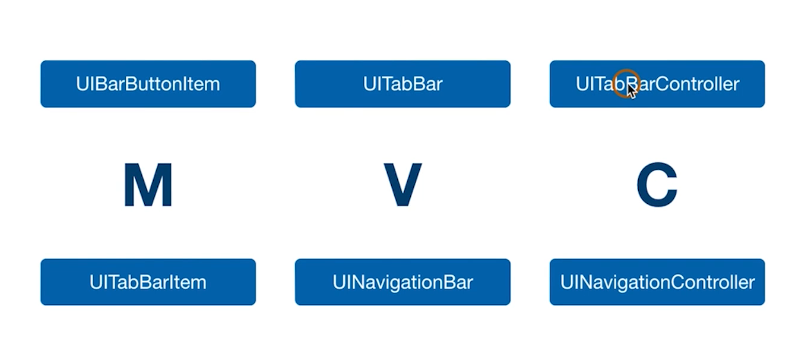

上图中的两个Controller都处理了一些逻辑。开发者提供Model，系统提供了View供交互，同时系统也提供了Controller做相应的处理。

### UIWindow

+ 特殊形式的UIView,提供App中展示内容的基础窗口
+ 只作为容器，和ViewController一起协同工作
+ 通常屏幕上只存在、展示一个UIWindow
+ 使用storyboard会帮助我们自动创建
+ 手动创建的步骤如下
    
    + 创建UIWindow
    + 设置rootViewController
    + makeKeyAndVisible

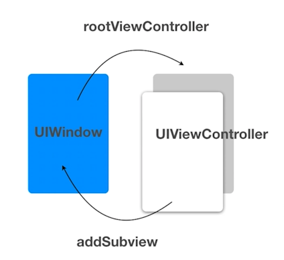

### App推荐

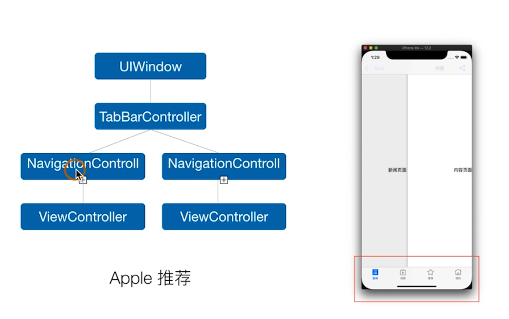

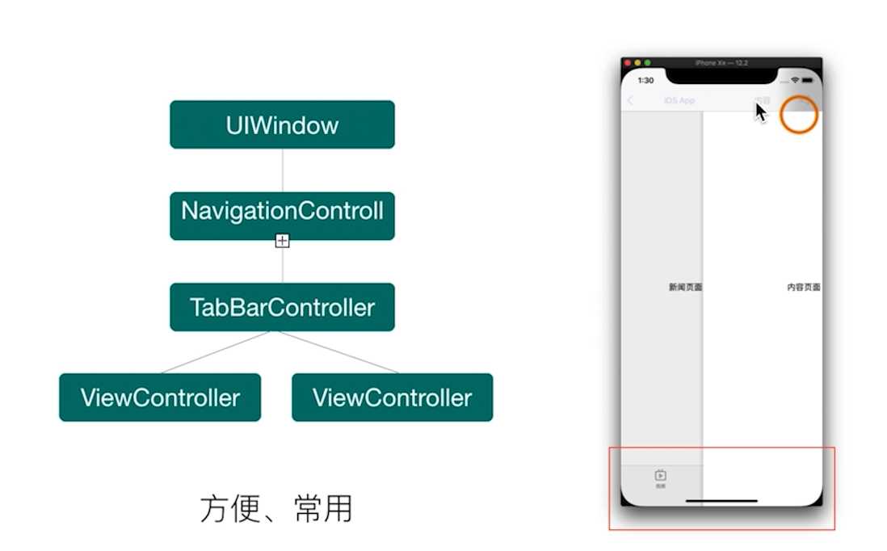

## delegate设计模式

UITabBarController设计了一些规范的协议，让我们自己去实现

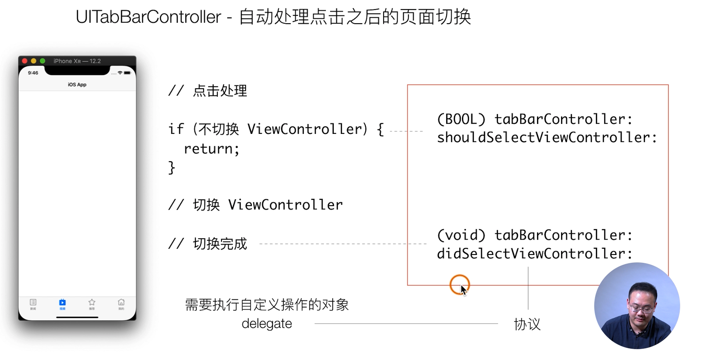

shouldSelectViewController可以判断是否切换```ViewController```

切换完成会触发didSelectViewController

### 如何使用delegate

1.设置self为delegate的接收者，也就是实现方法的对象

```objc
tabBarController.delegate = self;
```

2.根据需求按需实现方法

```objc
- (BOOL)tabBarController:(UITabBarController *)tabBarController shouldSelectViewController:(UIViewController *)viewController {
    return YES;
}

- (void)tabBarController:(UITabBarController *)tabBarController didSelectViewController:(UIViewController *)viewController {
    //播放这个viewController的第一个视频

}
```

### delegate设计模式

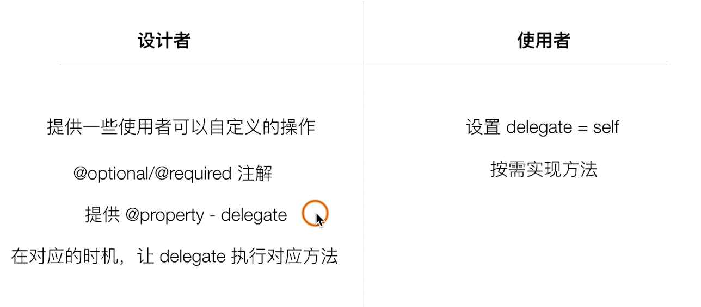

```objc
@interface SceneDelegate ()<UITabBarControllerDelegate>
...

tabbarController.delegate = self;

....

- (void)tabBarController:(UITabBarController *)tabBarController didSelectViewController:(UIViewController *)viewController {
    NSLog(@"进didSelectViewController");
};

```


